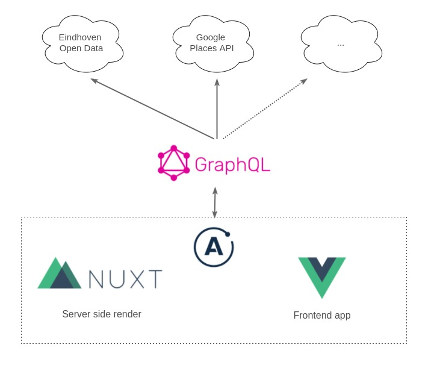

<!--  -->

Last Friday 17th March 2017, [@josepramon](https://twitter.com/josepramon), [@esclapes](https://twitter.com/esclapes) and I participated together in an internal hackaton of [Coosto](https://www.coosto.com/en/). The topic was to create something with the topic "Eindhoven". It was nice to see the variety of projects presented.

We wanted to play with [Apollo](http://dev.apollodata.com/), [GraphQL](http://graphql.org), and server-side rendering in [Vue](https://vuejs.org/) (with [Nuxt](https://nuxtjs.org/)), to get a feeling on whether it is beneficial to introduce them in the company. So we made [Dog shit](https://github.com/esclapes/coosto-hackathon), an app that collects data from [Eindhoven Open Data](https://data.eindhoven.nl/pages/home/) and [Google Places API](https://developers.google.com/places) in order to show places in Eindhoven where you can walk your dog, and what's around.

You can find the result [project on Github](https://github.com/esclapes/coosto-hackathon). It has the following architecture:

_Note: opinions in the article are personal and based on this experienced_

## GraphQL

**[GraphQL](http://graphql.org)** is a query language spec that Facebook developed on 2012. It serves exactly one purpose, and it does it really well:

> I'll give the frontend what it's asking for, and I'll take care of getting that data in the best way

It definitely nails that, we were amazed by how powerful is that and how pleasant the developer experience was. GraphQL:

- Gives you **introspection** and **docs**, given the Json/TypeScript-like language nature. It has a [GraphiQL](http://graphql.org/learn/serving-over-http/#graphiql) playground system where you can try your queries and see what they expect and return, powerful for development and testing.
- There are [implementations for most of languages](http://graphql.org/code/)
- Optimized and scalable for that purpose, offering caching and pagination among others.

GraphQL is an intermediate layer between your frontend and your backend. That has some **advantages**:

- You can query/return different data for different frontends. Imagine: your mobile app probably needs less data than your web app, or it needs it with another structure
- Helps refactoring legacy systems or moving to microservices, since it acts as a [BFF](http://samnewman.io/patterns/architectural/bff/) and takes on some responsibilities of an [API Gateway](http://microservices.io/patterns/apigateway.html) to decouple frontend and backend

It is the perfect replacement for traditional homemade BFFs, so you don't have to:

- Build a BFF per frontend (GraphQL allows you to query the data you want)
- Define hard-contracts between frontend and backend which you have to maintain (unless you build an spec/convention, which would mean building GraphQL from scratch on your own)
- Optimize it for the purpose (GraphQL is made for that)

## Apollo

Here again, the experience was quite positive, it complements GraphQL with everything you need.

Apollo is a production ready toolset that powers-up GraphQL. It gives you:

- [GraphQL clients](http://dev.apollodata.com/) for Android, iOS, Javascript, React, Angular...
- [A production-ready server](http://dev.apollodata.com/tools/#GraphQL-server-amp-tools) which extends [GraphQL.js server](http://graphql.org/graphql-js/)
- [Subscriptions](http://dev.apollodata.com/tools/#GraphQL-server-amp-tools), useful for real-time events. This feature feels like still needs some love by the date of writing.

One note, the docs were a bit misleading, not by content but more about the structure. For example if was hard to find a simple get started or docs for the apollo client.

We tried [vue-apollo](https://github.com/Akryum/vue-apollo), but we didn't have good experience with it. It is quite opinionated and does some magic, but you lose a lot of control. For our case the [Apollo Javascript client](https://github.com/apollographql/apollo-client) worked better.

## Nuxt

We felt the power and easyness of Nuxt, but also we got a sour-sweet experience here, let me elaborate on that.

[Nuxt](https://nuxtjs.org/) is a higher-level framework for writing universal Vue applications. It makes very easy to achieve server side rendering and you don't have to worry about any of the [server side rendering considerations](https://vuejs.org/v2/guide/ssr.html#Build-Process-Routing-and-Vuex-State-Hydration) such as caching, routing, state, build process, etc. It is driven by conventions which is what makes very easy to don't care about most things an let the framework manage that.

Those conventions have their pitfalls: when you need something more flexible and more control that you cannot fit to those conventions, then it is not the right tool for you. In our case this is true.

The bottom line is if you can stick to the conventions, is perfect for you. Otherwise, you must manage the server side rendering yourself. In the [Vue docs](https://vuejs.org/v2/guide/ssr.html#Build-Process-Routing-and-Vuex-State-Hydration) you can find some resources to master this for complex applications.

## Conclusion

There are some areas that we didn't have time for it, such as integrating a state management tool (Redux or Vuex), so we covered the basics in this experiment.

We found Apollo/GraphQL as a very powerful tool for medium and large apps, it does really well what is made for. Nuxt makes building universal Vue apps be a kid game, but first check if it fits properly with your project. Tools that strongly integrate technologies, such as vue-apollo or Nuxt itself, have their advantages, but first check if they are the best solution for your case. If not, you can always use the "raw" tools.
